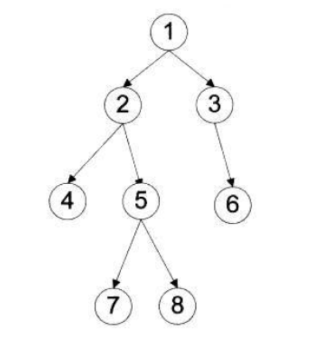

<!--
 * @Author: xaingly
 * @Date: 2020-05-13 13:25:39
 * @LastEditTime: 2020-05-13 14:09:54
 * @LastEditors: Please set LastEditors
 * @Description: 二叉树 前序 中序 后序代码
 * @FilePath: \Learning\BinaryTree.md
 -->

# 二叉树



## 前序

### 中心思想

根节点 => 左子树 =>右子树

### 顺序

1 2 4 5 7 8 3 6

### 代码

```js
```

## 中序

### 中心思想

左子树 => 根节点 => 右子树

### 顺序

4 2 7 5 8 1 3 6

### 代码

```js
```

## 后序

### 中心思想

左子树 => 右子树 =>根节点

### 顺序

4 7 8 5 2 6 3 1

### 代码

```js
```
